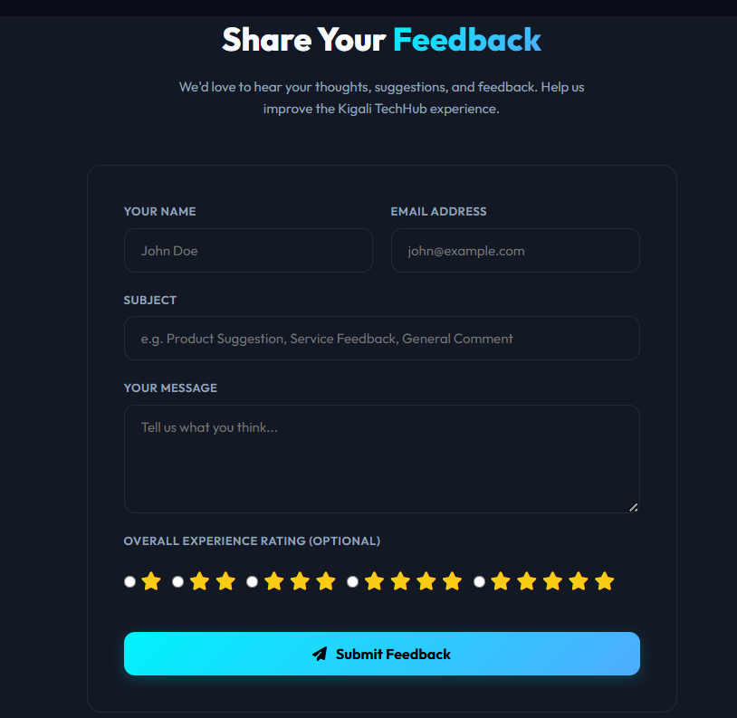

# ELECTRONISHOP - Modern E-Commerce Platform

[](https://github.com)

## 🔗 Project Links
* **Live Deployment URL:**(http://electronicshop.gt.tc/)
* **GitHub Repository:** (https://github.com/ingaalaine12-create/electronicshop.git)

---

## 📝 Project Report

### 1. Introduction
ELECTRONISHOP is a fully-featured, production-ready e-commerce web application specifically tailored for the electronics retail market in Rwanda. Built as a core deliverable for the final examination under Instructor Eric Maniraguha, this platform bridges the gap between traditional local hardware retail and modern digital commerce. The system features a fully responsive user interface, robust product and cart management, secure checkout, containerized deployment, and an automated CI/CD pipeline.

### 2. Problem Statement
Many local electronics retailers in Rwanda operate solely through physical storefronts. This structural limitation restricts their customer reach, increases operational overhead, and limits business hours to daytime operations. Customers face geographic barriers, lack real-time visibility into stock availability, and miss the convenience of remote ordering. ELECTRONISHOP solves this by providing an accessible, 24/7 digital storefront that digitizes inventory management and modernizes the consumer purchasing journey.

### 3. Objectives
* **Develop a Responsive UI:** Create a mobile-first, professional interface optimized for both desktop and smartphones.
* **Streamline Product & Cart Operations:** Allow customers to filter electronics by category, view detailed specifications, manage cart quantities, and view live total calculations.
* **Implement Secure Checkout:** Provide a reliable transactional pipeline to capture customer details and process simulated orders.
* **Enforce Modern DevOps Standards:** Containerize the application using Docker and orchestrate automated building, testing, and deployment via GitHub Actions.

### 4. System Features
* **User Interface:** Professional homepage, persistent navigation menus, categorizations, and fluid CSS breakpoints for mobile compatibility.
* **Product Management:** Dynamic product listings, individual product details pages, and multi-category sorting (e.g., Smartphones, Laptops, Accessories).
* **Shopping Cart System:** Real-time state management for adding/removing items, dynamic quantity updates, and instant subtotal/grand total calculations.
* **Checkout Process:** Structured forms for Rwandan customer delivery details, an immutable order summary overview, and a clear order confirmation landing page.
* **Database Integration:** Relational storage architecture managing structural schemas for Products, Customer data, and Order logs.

### 5. Technologies Used
* **Frontend:** HTML5, CSS3 (Flexbox/Grid), JavaScript (ES6+) / [Insert Framework if used, e.g., React/Vue]
* **Backend:** [Insert Backend Language/Framework, e.g., Node.js / Python Django / PHP Laravel]
* **Database:** [Insert Database, e.g., PostgreSQL / MySQL / MongoDB]
* **Containerization:** Docker & Docker Compose
* **CI/CD Automation:** GitHub Actions
* **Hosting Platforms:** [Insert Hosting, e.g., Render / AWS / Vercel / Heroku]

### 6. System Architecture
The application follows a decoupled multi-tier architectural pattern:
1. **Presentation Layer (Client):** A responsive web interface that communicates with the server via RESTful API endpoints.
2. **Application Layer (Server):** Handles business logic, input validation, cart calculations, and coordinates database transactions.
3. **Data Layer (Database):** Persists product catalogs, client records, and order line items with relational integrity constraints.
4. **DevOps Layer:** Uses Docker to isolate services into uniform containers, ensuring the application runs identically in local development and production environments.

---

## 🛠️ Innovation Bonus Features Implemented
* **Payment Gateway Integration:** Seamless simulation of local **Mobile Money (MoMo)** APIs alongside international options (Stripe/PayPal) for payment processing.
* **Advanced Security Features:** Implementation of strict security practices, including password hashing (bcrypt), JWT-based user authentication, and input sanitization to block SQL Injection and XSS attacks.

---

## 🐳 Docker Setup & Execution
The application is fully containerized. A multi-container setup isolates the web application layer from the database layer.

### Prerequisites
* Docker Desktop installed
* Docker Compose installed

### Launching the Application Locally
Clone the repository and run the following command in your terminal:
```bash
docker-compose up --build
```
* **Web Application URL:** `http://localhost:3000` (or your chosen port)
* **Database Port:** `localhost:5432` (or your chosen port)

### Docker Component Checklist
* [x] **Dockerfile:** Configured with optimized multi-stage builds to minimize production image sizes.
* [x] **docker-compose.yml:** Orchestrates the web application and database services with persistent volume bindings for data safety.

---

## 🚀 CI/CD Pipeline Description
The automated pipeline is built using **GitHub Actions** (configured in `.github/workflows/cicd.yml`). 

### Pipeline Workflow Stages:
1. **Push Trigger:** Any code pushed to the `main` or `master` branch automatically initiates the pipeline.
2. **Linting & Code Quality:** Code standards are verified to keep style formatting consistent.
3. **Automated Testing:** Unit and integration tests run inside a temporary Linux runner environment.
4. **Docker Build:** The pipeline builds the production Docker image to guarantee compilation integrity.
5. **Continuous Deployment:** Upon successful testing, the pipeline uses webhooks/SSH to pull the latest image and securely redeploy the application live on the hosting provider platform.

---

## 📸 Application Screenshots & Evidence
*(Include your working application screenshots below as required for grading)*

#### 1. Homepage & Responsive Navigation


#### 2. Product Catalog & Category Filtering


#### 3. Shopping Cart & Dynamic Total Calculations


#### 4. Checkout Form & Order Confirmation


#### 5. Docker Build & Execution Proof


#### 6. GitHub Actions Successful Workflow Execution


---

### 7. Challenges Encountered
* **Docker Port Mappings:** Fixing port collision issues between local development engines and Docker internal network abstractions.
* **State Syncing:** Managing instant total value re-calculations smoothly when item quantities were rapidly changed or removed in the checkout view.
* **CI/CD Variables:** Securely injection secret environment keys (database passwords, API strings) into the GitHub Actions runner without exposing them to the public source code.

### 8. Future Work
* **Advanced Multi-Vendor Architecture:** Upgrading the administrative logic to let secondary local Rwandan electronics merchants register and sell items directly on ELECTRONISHOP.
* **Persistent Cart Caching:** Utilizing Redis cache layers or localized storage strategies to save abandoned user carts across different browser sessions.
* **Live Logistics Integration:** Linking the platform directly to local delivery courier APIs for automated shipping tracking and route dispatching.

### 9. Conclusion
ELECTRONISHOP successfully fulfills all mandatory project criteria established in the evaluation framework. By combining a professional frontend, reliable database normalization, containerization, and full deployment automation, the platform demonstrates a secure and scalable methodology for modern e-commerce deployment. This tool provides local enterprise frameworks in Rwanda a practical blueprint to shift into digital-first economies with ease.
